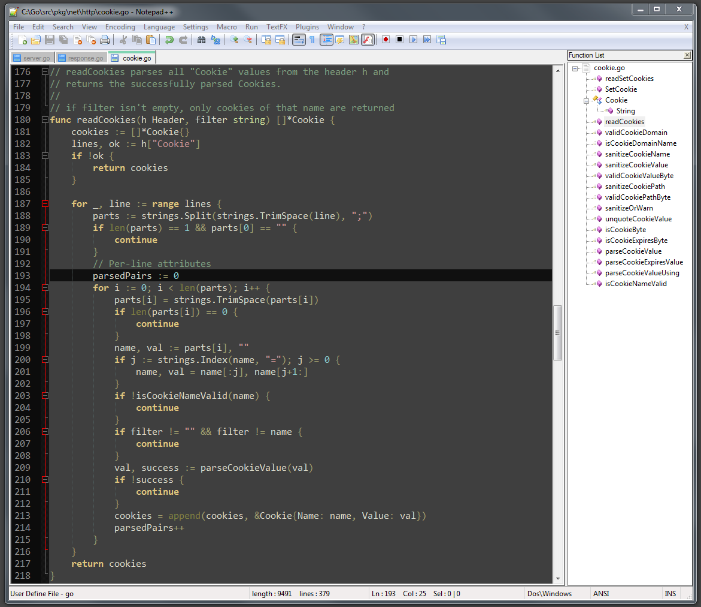

notepadplusplus.go
==================

zenburn-style syntax highlighting and code folding for go in notepad++

1. Download go.xml and copy it to plugins\APIs\.

2. Add the contents of userDefineLang.xml to your systems userDefineLang.xml between <NotepadPlus> and </NotepadPlus>.

3. Edit local functionList.xml according to functionList.xml.

4. Restart Notepad++
